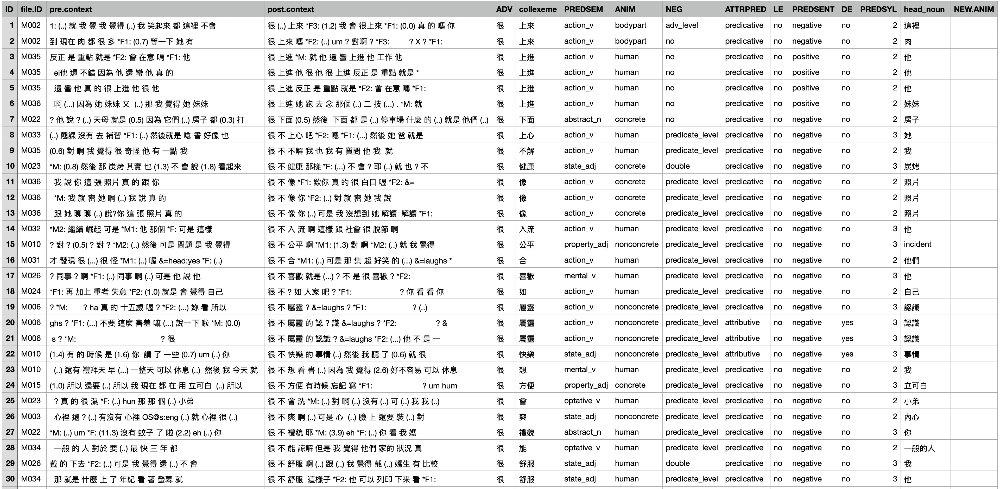

```{r include=F, purl=F}
## Rmarkdown settings
knitr::opts_chunk$set(message = F, warning = F)
knitr::opts_chunk$set(fig.width=8, fig.height=6, dpi=300, fig.retina=2, cols.print = 5)

## Automatically use showtext to render plots
## If loading showtext throws errors, install: https://www.xquartz.org/
library(showtext)
showtext_auto(enable = TRUE)

#rmarkdown::render("collostruction_analysis.Rmd", html_pretty(), output_dir = "docs")
```

<p align="center">
  👉 <a href="https://mybinder.org/v2/gh/alvinntnu/collostruction_tutorial/main?urlpath=rstudio" target="_blank" style="font-weight:bold;">
  Launch Tutorial in Binder
  </a>
</p>


## Loading packages

```{r}
library(tidyverse)
library(tidytext)
library(quanteda)
library(stringr)
library(jiebaR)
library(readtext)
```

## Objectives

In this tutorial, I would like to talk about the relationship between a construction and words. Words may co-occur to form **collocation** patterns. When words co-occur with a particular morphosyntactic pattern, they would form **collostruction** patterns.

Here I would like to introduce a widely-applied method for research on the meanings of constructional schemas---**Collostructional Aanalysis** [@stefanowitsch2003]. This is the major framework in corpus linguistics for the study of the relationship between words and constructions.

The idea behind collostructional analysis is simple: the meaning of a morphosyntactic construction can be determined very often by its co-occurring words.

In particular, words that are strongly associated (i.e., co-occurring) with the construction are referred to as **collexemes** of the construction.

**Collostructional Analysis** is an umbrella term, which covers several sub-analyses for constructional semantics:

-   **Collexeme** Analysis (cf. @stefanowitsch2003)
-   **Co-varying Collexeme** Analysis (cf. @stefanowitsch2005)
-   **(Multiple) Distinctive Collexeme** Analysis (cf. @gries2004)

This tutorial will first focus on **collexeme analysis**, whose principles can be extended to the other analyses.

Also, I will demonstrate how we can conduct a collexeme analysis by using the R script written by Stefan Gries ([Collostructional Analysis](http://www.stgries.info/teaching/groningen/index.html)).

## Corpus

As a demonstration, we use the Apple News Corpus (`demo_data/applenews10000.tar.gz`).

Our target is the Chinese construction `X + 起來`. The goal is to discover which words most frequently fill the `X` slot and what this reveals about the semantics of the construction.

That is, we want to identify the collexemes of `X + 起來` and examine how coherent they are in meaning.

We begin by loading the corpus and creating a `corpus` object.

```{r purl=T}
## Load Data
apple_df <-
  readtext("demo_data/applenews10000.tar.gz", encoding = "UTF-8") %>% ## loading data
  filter(!str_detect(text, "^\\s*$")) %>% ## removing empty docs
  mutate(doc_id = row_number()) ## create index
```

::: try

Raw texts often contain unwanted characters such as invisible **control codes**, **extra spaces**, or **duplicate line breaks**.

These can interfere with segmentation accuracy. It is therefore a good idea to clean the texts before tokenization.

Here we used a simple function, `normalize_document()`, but you can always design a more specialized version for your own data.

:::

- Define how we would like to preprocess the data:

```{r}
## Text normalization function
## Define a function
normalize_document <- function(texts) {
  texts %>%
    str_replace_all("\\p{C}", " ") %>%  ## remove control chars
    str_replace_all("[\\s|\\n]+", " ") %>%  ## replace whitespaces/linebreaks with one whitespace
    trimws
}
```

- An example:

```{r}
## Example usage of `normalize_document()`
## before cleaning
apple_df$text[1]
## after cleaning
normalize_document(apple_df$text[1])
```

- Preprocess all texts in the corpus

```{r}
## Apply cleaning to all docs
apple_df$text <- normalize_document(apple_df$text)
```

```{r echo=F, purl=F}
apple_df %>%
  head(100) %>%
  mutate(text = str_sub(text, 0,100) %>% sprintf("%s...",.))
```


## Word Segmentation

Next we segment the texts into words using `jiebaR.` The steps are:

- Initialize a `jiebar` segmentation model with `worker()`.
- Define a function `word_seg_text()` to tokenize the text and, if needed, add POS tags.
- Apply this function to all texts and create a new column containing the segmented strings.

This new column will serve as the basis for later construction extraction.

```{r purl=T}
# Initialize jiebar
segmenter <- worker(user = "demo_data/dict-ch-user.txt",
                    bylines = F, ## ignore lines
                    symbol = F)  ## ignore symbols
```

```{r}
# Define function
word_seg_text <- function(text, jiebar) {
  segment(as.character(text), jiebar) %>% # word tokenize
    str_c(collapse = " ") ## concatenate word tokens into long strings
}
```

```{r}
# Apply the function
apple_df <- apple_df %>%
  mutate(text_tag = map_chr(text, ~ word_seg_text(.x, segmenter)))
```

::: info

The function `word_seg_text()` tokenizes Chinese text into words and produces an enriched version of the text with explicit word boundaries.

```{r}
word_seg_text(apple_df$text[1], segmenter)
```

:::

::: alert

In this example we did not add POS tags in order to keep things simple.
For actual research, POS information can be very useful for retrieving constructions more accurately. You may therefore want to adapt both the `word_seg_text()` function and the `worker()` model to include POS tagging.

:::


```{r echo=F, purl=F}
apple_df %>%
  head(100) %>%
  mutate(text = str_sub(text, 0,100) %>% sprintf("%s...",.),
         text_tag = str_sub(text_tag, 0,100) %>% sprintf("%s...",.))
```


## Extract Constructions

With segmented texts, we can now extract our target construction `X + 起來` using a regular expression and `unnest_tokens()`.

::: info

Both [regular expressions](https://en.wikipedia.org/wiki/Regular_expression) and [corpus query languages](https://www.sketchengine.eu/documentation/corpus-querying/) share the idea of pattern matching. They let you describe a search pattern in a formal way and then scan through text to find all the places where that pattern occurs. In both cases, you write rules instead of manually searching, which makes them powerful for handling large amounts of data.

The key difference is that regex patterns work only on surface strings, while corpus query languages extend this logic to structured linguistic information.

:::


- Define the constructional pattern:

```{r purl=T}
# Define regex
pattern_qilai <- "[^\\s]+\\s起來\\b"

```

- Extract the patterns from the corpus

```{r}
# Extract patterns
apple_qilai <- apple_df %>%
  select(-text) %>% ## dont need original texts
  unnest_tokens(
    output = construction, ## name for new unit
    input = text_tag, ## name of old unit
    token = function(x) ## unnesting function
      str_match_all(x, pattern = pattern_qilai)
  )

```

- Check the results

```{r}
# Print
apple_qilai
```

## Exploratory/Descriptive Analysis

Usually before the statistical/quantitative analysis, we examine our data in an exploratory way.

```{r}
apple_qilai %>%
  group_by(construction) %>%
  summarize(freq = n(),
            docfreq = n_distinct(doc_id)) -> apple_qilai_dist

apple_qilai_dist %>% 
  arrange(-freq) %>%
  top_n(50, freq)
```

## Distributional Information Needed for Collostruction Analysis

To perform the **collexeme analysis**, which is essentially a statistical analysis of the association between words and a specific construction, we need to collect necessary distributional information of the words (`X`) and the construction (`X + 起來`).

In particular, to use Stefan Gries' R script of Collostructional Analysis, we need four types of frequency information:

1. Joint frequencies of each word with the construction.
2. Word frequencies in the entire corpus.
3. Total corpus size (number of tokens).
[4. Construction size (number of construction tokens).]

::: info

Example with the word `使用`:

- Joint frequency = number of times `使用 + 起來` occurs.
- Word frequency = total count of `使用` in the corpus.
- Corpus size = total number of word tokens.
- (Construction size = number of `X + 起來` tokens.)

:::

### Word Frequency List

We start by creating a word frequency list for the corpus.

This involves converting the **text-based** data frame into a **word-based** one and counting token frequencies.

```{r purl=T}
## create word freq list
apple_word_freq <- apple_df %>%
  select(-text) %>% ## dont need original raw texts
  unnest_tokens( ## tokenization
    word,  ## new unit
    text_tag,  ## old unit
    token = function(x)  ## tokenization function
      str_split(x, "\\s+")
  ) %>%
  filter(nzchar(word)) %>% ## remove empty strings
  count(word, sort = T)

apple_word_freq %>%
  head(100)
```

::: alert
In the above example, when we convert our data frame from a text-based to a word-based one, we didn't use any specific tokenization function in `unnest_tokens()` because we have already obtained the **enriched version** of the texts, i.e., texts where each word token is delimited by a white-space. Therefore, the `unnest_tokens()` here is a lot simpler: we simply tokenize the texts into word tokens based on the **known delimiter**, i.e., the white-spaces.
:::

### Joint Frequencies

We now calculate the joint frequencies of `X `and the construction `X + 起來`.

Since we also have the word frequency list, we can link these counts together.


```{r purl=T}
## Joint frequency table
apple_qilai_freq <- apple_qilai %>%
  count(construction, sort = T) %>%  ## get joint frequencies
  tidyr::separate(col = "construction", ## restructure data frame
                  into = c("word", "construction"),
                  sep = "\\s") %>%
  ## identify the freq of X in X_起來
  mutate(word_freq = apple_word_freq$n[match(word, apple_word_freq$word)])

apple_qilai_freq
```

### Input for `coll.analysis.r`

Now we have almost all distributional information needed for the Collostructional Analysis.

Let's see how we can use Stefan Gries' script, `coll.analysis.r`, to perform the collostructional analysis on our data set.

Stefan Gries’ `coll.analysis.r` expects a **tab-delimited** file with three columns:

- Word
- Word frequency in the corpus
- Joint frequency with the construction


```{r purl=T}
## prepare a tsv
## for coll analysis
apple_qilai_freq %>%
  select(word, word_freq, n) %>%
  write_tsv("qilai.tsv")
```

::: alert
Be sure to save the input as a **TSV** (tab-delimited) file, not **CSV**.
The script will not accept comma-delimited input.
:::

### Corpus Size

In addition to the input file, Stefan Gries' `coll.analysis.r` also requires a few general statistics for the computing of association measures.

We prepare necessary distributional information for the later collostructional analysis:

1.  Corpus size: The total number of words in the corpus
2.  Construction size: the total number of the construction tokens in the corpus

Later when we run Gries' script, we need to enter these numbers manually in the terminal.

```{r purl=T}
## corpus information
cat("Corpus Size: ", sum(apple_word_freq$n), "\n")
cat("Construction Size: ", sum(apple_qilai_freq$n), "\n")
```

------------------------------------------------------------------------

::: try

Sometimes you may want to save console output for later use.

The function `sink()` redirects printed output to a file.

```{r purl=T, results=F, collapse=T}
## save info in a text
sink("qilai_info.txt") ## start flushing outputs to the file not the terminal
cat("Corpus Size: ", sum(apple_word_freq$n), "\n")
cat("Construction Size: ", sum(apple_qilai_freq$n), "\n")
sink() ## end flushing
```

This will create a file `qilai_info.txt` in your working directory with the saved results.

:::


## Running Collostructional Analysis

We are now ready to run the analysis by sourcing [`coll.analysis.r`](https://www.stgries.info/teaching/groningen/index.html), available on Stefan Gries’ website.


```{r eval=F, echo=T, purl=T}
######################################
##      Preloading Gries' Functions ##
######################################
source("https://www.stgries.info/teaching/groningen/coll.analysis.r")


## Run the interactive analysis
coll.analysis()
```

------------------------------------------------------------------------

The script runs interactively, asking you to provide the required information.

For our example, the answers would be:

- `Analysis to perform`: 1
- `Name of construction`: QL
- `Corpus size`: `r sum(apple_word_freq$n)`
- `Fisher-Yates`: no
- `Tab-delimited input data`: `qilai.tsv`

------------------------------------------------------------------------

If everything runs correctly, you will get a tab-delimited CSV output file in your working directory with the results.

## Interpretations

The output is a tab-delimited file with statistics for each candidate collexeme.

A sample result file is available in in the root directory `2025-10-XX XX-XX-XXXX.csv`.

- We load the results and check the top collexemes:

```{r purl=T}

## convert into CSV
collo_table<-read_tsv("2025-10-03 08-35-47.915105.csv")

## auto-print
collo_table %>%
  filter(RELATION =="attraction") %>%
  arrange(desc(LLR)) %>%
  head(50) %>%
  select(WORD, LLR, everything())
```

The output includes several useful **COLLSTRENGTH** measures, specifying the association between the collexemes and the slot of the construction (`V + 起來`).

- LLR/PMI
- Log Odds Ratio
- Delta P
- Kullback-Leibler Divergence (KLD)

------------------------------------------------------------------------

With these statistics, we can identify the strongest collexemes according to different measures.

Here we focus on the top 10 collexemes by four metrics:


1.  `QL`: joint frequency of word and construction
2.  `DELTAPC2W`: delta P (construction → word)
3.  `DELTAPW2C`: delta P (word → construction)
4.  `LLR`: log-likelihood ratio

```{r out.height = "100%", purl=T}
## from wide to long
collo_table %>%
  filter(RELATION == "attraction") %>%
  filter(QL >=5) %>%
  select(WORD, QL, 
         DELTAPC2W, 
         DELTAPW2C,
         LLR) %>%
  pivot_longer(cols=c("QL", 
                      "DELTAPC2W", 
                      "DELTAPW2C",
                      "LLR"),
               names_to = "METRIC",
               values_to = "STRENGTH") %>%
  mutate(METRIC = factor(METRIC, 
                         levels = c("QL", 
                                   "DELTAPC2W",
                                   "DELTAPW2C",
                                   "LLR"))) %>%
  group_by(METRIC) %>%
  top_n(10, STRENGTH) %>%
  ungroup %>%
  arrange(METRIC, desc(STRENGTH)) -> coll_table_long

## plot
coll_table_long %>%
    mutate(WORD = reorder_within(WORD, within= METRIC, by=STRENGTH)) %>%
    ggplot(aes(WORD, STRENGTH, fill=METRIC)) +
    geom_col(show.legend = F) +
    scale_fill_brewer(palette = "Dark2") +
    coord_flip() +
    facet_wrap(~METRIC,scales = "free") +
    tidytext::scale_x_reordered() + 
    labs(x = "Collexemes",
         y = "Strength",
         title = "Collexemes Ranked by Different Metrics")
```

The bar plots above show the top 10 collexemes based on four different metrics: `QL`, `DELTAPC2W`, `DELTAPW2C`, and `LLR`.

::: alert

Please review the assigned readings for details on how **collostructional strengths** are calculated.
In particular, @stefanowitsch2003 explains why Fisher’s exact test-based measures provide advantages over raw frequency counts.

Also note that **delta P** is a directional association measure that has been increasingly used in psycholinguistic research (see @ellis2006; @gries2013).

It is important to understand both how delta P is computed and how it should be interpreted.

:::


::: exercise
If we look at the top 10 collexemes ranked by the collostrength, we would see a few puzzling collexemes, such as `一`, `了`, `不`. Please identify these puzzling construction tokens as concordance lines (using `quanteda::kwic()`)and discuss their issues and potential solutions.
:::

```{r eval=T, echo=F}
apple_tokens<-as.tokens(str_split(apple_df$text_tag,"\\s+"))
kwic(apple_tokens, pattern = phrase("了 起來"))
kwic(apple_tokens, pattern = phrase("一 起來"))
kwic(apple_tokens, pattern = phrase("不 起來"))
```

## Distinctive Collexeme Analysis

We can also use Stefan Gries’ script `coll.analysis.r` to perform a **Distinctive Collexeme Analysis**.

To illustrate this method, let’s use data from the following study:

> Huang, P. W., & Chen, A. C. H. (2022). Degree adverbs in spoken Mandarin: A behavioral profile corpus-based approach to language alternatives. *Concentric: Studies in Linguistics*, 48(2), 285–322.

In this work, the focus is on differences among four Mandarin degree adverbs: `很`, `蠻/滿`, `超`, and `太`.

As before, we run the interactive function `coll.analysis()`.  

For this example, the answers to the prompts would be:

-   `analysis to perform`: 2 (Distinctive Collexeme Analysis)  
-   `number of distinctive categories`: 2 (or more if there are 3+ alternatives)  
-   `tab-delimited input data`: `<demo_data/input-distcollexeme.tsv>`  

:::info

For a **Distinctive Collexeme Analysis**, the input should be a data frame that lists each construction token in the corpus, with two key columns:

1. The **collexeme** (the co-occurring word)  
2. The **constructional element** (the construction category being compared)  

In our case, the constructional elements are the degree adverbs, and the collexemes are their co-occurring modifyees.  

The following figure shows how these were annotated in concordance lines:

```{r echo=F, out.width="100%"}

```

For Stefan’s script, we only need these two columns from the data: the collexemes and their associated constructional element.

```{r echo=F}
read_tsv(file = "demo_data/input-distcollexeme.tsv") %>%
  group_by(CONSTRUCTION) %>%
  sample_n(10) %>%
  ungroup
```

:::

------------------------------------------------------------------------

Once the script runs, it generates the results as a tab-delimited CSV file in the root directory.

An example output file is included in this project.

```{r}
### Distinctive Collexeme Analysis: Results Exploration
dist_results <- read_tsv("2025-10-02 04-10-56.334203.csv")

dist_results
```

::: info

In *distinctive collexeme analysis*, the two columns mean:

**`SUMABSDEV`** shows how unevenly a word appears across the constructions. The larger this number, the more the word favors one construction over the others.

**`LARGESTPREF`** tells you *which* construction the word favors most — the one where it appears more often than expected.

So, if a collocate has a high `SUMABSDEV` and `LARGESTPREF = A`, it means the word occurs much more often in Construction A than chance would predict.

:::

And our next step is to explore the semantic patterns from the output:

```{r}
dist_results %>%
  group_by(LARGESTPREF) %>%
  top_n(10, SUMABSDEV) %>%
  select(COLLOCATE, SUMABSDEV, LARGESTPREF) %>%
  ungroup %>%
  arrange(LARGESTPREF) %>%
  mutate(COLLOCATE = reorder_within(COLLOCATE, within= LARGESTPREF, by=SUMABSDEV)) %>%
  ggplot(aes(COLLOCATE, SUMABSDEV, fill=SUMABSDEV)) +
    geom_col(show.legend = F) +
    scale_fill_distiller(palette="YlOrRd", direction=1)+
    coord_flip() +
    facet_wrap(~LARGESTPREF,scales = "free") +
    tidytext::scale_x_reordered() + 
    labs(x = "COLLOCATE",
         y = "STRENGTH(SUMABSDEV)",
         title = "DISTINCTIVE COLLEXEMES")

```

## References

